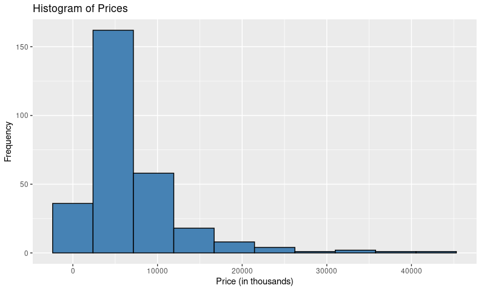

# 🏠 Real Estate Market Analysis: Mini Project

**Author:** Paul Mutuku  
**Date:** June 2025  
**Tools Used:** R, ggplot2, dplyr, readxl, lares, janitor

---

## 📄 Project Overview

This project explores a real estate dataset with the aim of understanding key property characteristics, performing descriptive and inferential statistical analysis, and building a regression model to estimate price drivers.

---

## 📂 Dataset Summary

- **Original Dataset Size:** 9,076 observations × 20 variables  
- **Cleaned Dataset Size:** 291 observations × 6 numeric variables  
- **Key Variables:**  
  - `price` (converted to thousands)  
  - `number_of_units`  
  - `total_area` (in acres)  
  - `lot_size` (in acres)  
  - `number_of_stories`  
  - `age` (calculated as 2022 - year_built)

## 📊 Descriptive Statistics

| Measure      | Price (K) | Units | Total Area (acres) | Lot Size (acres) | Age (yrs) |
|--------------|-----------|--------|--------------------|------------------|-----------|
| **Mean**     | 6,738.7   | 53.7   | 1.09               | 2.97             | 58.2      |
| **Median**   | 4,500.0   | 31.0   | 0.53               | 0.49             | 53.0      |
| **IQR**      | 5,360.0   | 57.5   | 1.02               | 2.67             | 49.0      |
| **Variance** | 36,052,876| 4521.4 | 2.16               | 53.03            | 1238.4    |
| **Std Dev**  | 6,004.4   | 67.2   | 1.47               | 7.28             | 35.2      |

## 📈 Visualizations

### 💵 Histogram of Prices (Filtered at ≤ $25M)

### 🏢 Number of Stories Distribution

| Number of Stories | Count |
|-------------------|-------|
| 1                 | 23    |
| 2                 | 133   |
| 3                 | 64    |
| 4                 | 34    |
| 5                 | 14    |

### 🧮 Mean Price by Number of Stories

| Stories | Mean Price (K) |
|---------|----------------|
| 5       | 9,346          |
| 4       | 7,331          |
| 3       | 6,887          |
| 2       | 5,482          |
| 1       | 2,895          |

> 📌 **Insight:** Prices increase with the number of stories, suggesting vertical development may carry premium value.

## 🔍 Correlation Analysis

Correlation with price:

- `number_of_stories`: **+0.52**
- `total_area`: **+0.39**
- `number_of_units`: **+0.34**
- `lot_size`: **+0.17**
- `age`: **−0.27**

### 📉 Scatterplot: Price vs Total Area

- **R-squared** = 0.152  
> 🧾 Indicates a modest positive linear relationship between total area and price.

## 📐 Regression Model

**Model:** `price ~ number_of_units + total_area + number_of_stories + lot_size + age`

| Predictor          | Coefficient | Std. Error | p-value   | Significance |
|--------------------|-------------|------------|-----------|--------------|
| Intercept          | 1153.45     | 743.23     | 0.122     |              |
| number_of_units    | 10.91       | 12.36      | 0.378     |              |
| total_area         | 940.30      | 592.96     | 0.114     |              |
| number_of_stories  | 1877.45     | 254.78     | **<0.001**| ***          |
| lot_size           | 5.52        | 34.31      | 0.872     |              |
| age                | -24.18      | 7.55       | **0.002** | **           |

- **R-squared:** 32.8%  
- **Adjusted R-squared:** 31.5%  
- **F-statistic p-value:** < 2.2e-16

> 🔍 **Interpretation:**
> - Properties with more stories are significantly more expensive.
> - Older properties are generally less expensive.
> - Lot size and units did not significantly predict price in this sample.

## 🧾 Conclusions

- Properties with **more stories** and **larger total area** generally fetch higher prices.
- **Age** has a significant negative effect on price.
- Despite many variables, the regression model explains **~33%** of price variance.

